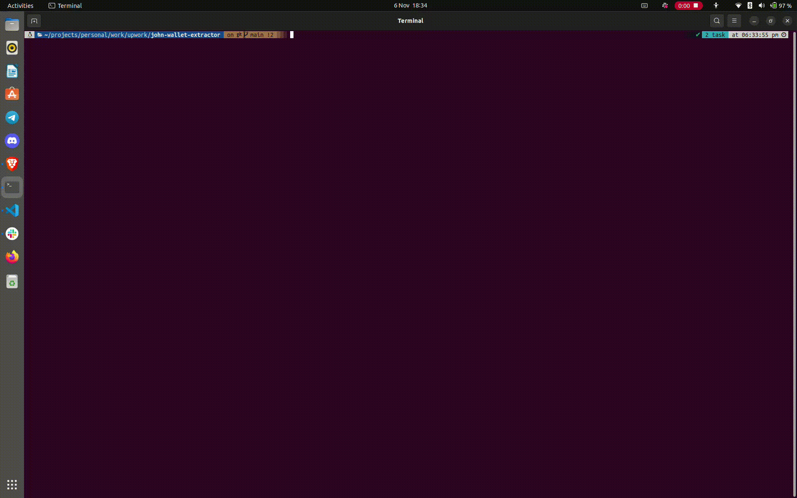

# extract-wallets

A script that extract wallets that meet specific creteria

## How to operate the bot

- Downloaded and extract the zipped file into a folder
- `cd` into the folder
- Run `yarn`, this will install the projects dependencies and setup the bot for use.
- To run the bot enter the command `yarn start` and follow the prompt on the terminal.

## Demo

